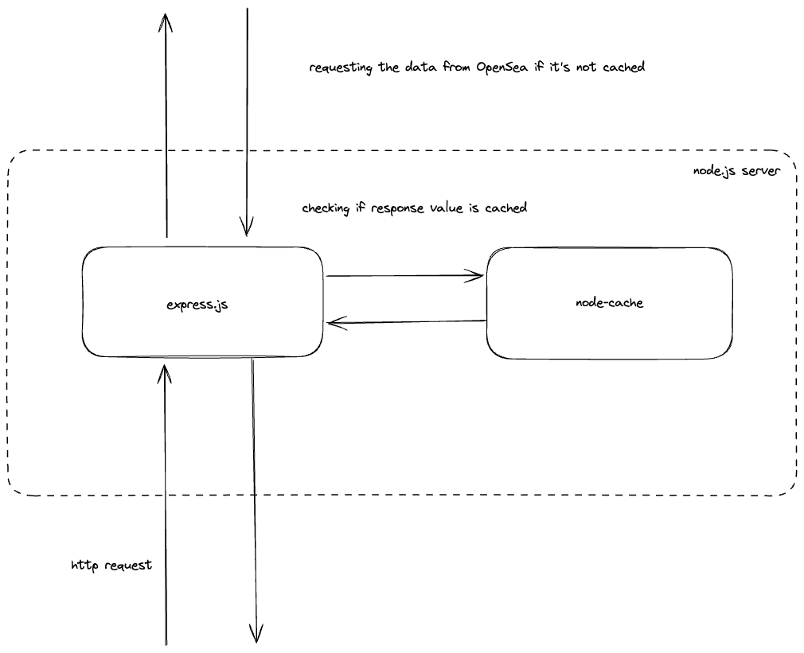
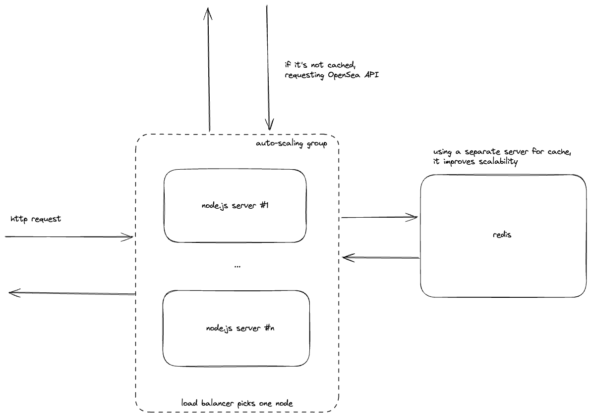

## Pudgy Penguins Viewer Backend

This is a simple web service based on Express.js.

It acts as a proxy to Opensea API to fetch NFTs.

It uses node-cache to avoid API limits.

## Tech stack

- express
- axios
- node-cache

## How it works now

## How it can be improved
